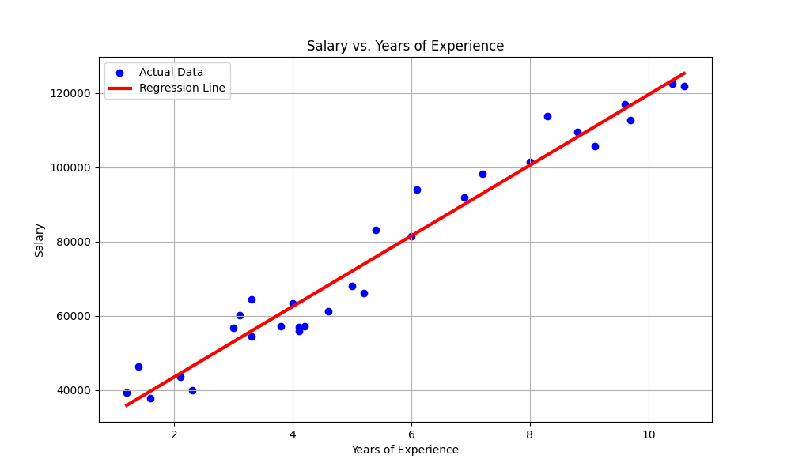

# Linear Regression Model - Salary Prediction

This repository contains a simple implementation of **Linear Regression from scratch** using Python and NumPy.
The model predicts **Salary** based on **Years of Experience** using gradient descent to optimize the parameters.

---

## Features

* Loads training data from a CSV file (`Salary_dataset.csv`).
* Implements gradient descent to update **weight (W)** and **bias (B)**.
* Trains the model over multiple epochs while printing the loss (cost) every 100 iterations.
* Plots the regression line against actual data for visualization.

---

## How It Works

The model follows the equation:

$$
Y = WX + B
$$

* **W** = weight (slope)
* **B** = bias (intercept)
* **X** = input feature (Years of Experience)
* **Y** = target (Salary)

The algorithm:

1. Makes predictions using current `W` and `B`.
2. Calculates the **Mean Squared Error (MSE)** cost.
3. Computes gradients for `W` and `B`.
4. Updates the parameters using **gradient descent**.

---

## Requirements

* Python 3.x
* NumPy
* Pandas
* Matplotlib

Install dependencies using:

```bash
pip install numpy pandas matplotlib
```

---

## Usage

1. Clone the repository
2. Place your `Salary_dataset.csv` file in the project folder
3. Run the Python script:

```bash
python linear_regression.py
```

---

## Output

* Final learned weight and bias printed in the console
* Cost values printed every 100 epochs
* Scatter plot of data points with regression line

---

## Example Visualization

After training, you'll see a plot like this:

* **Blue dots** → Actual data points
* **Red line** → Predicted regression line

